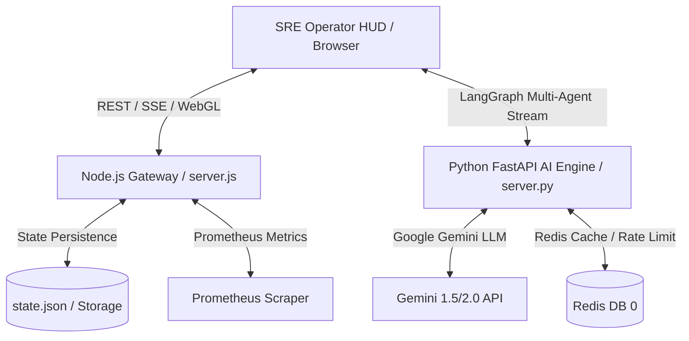

<!-- Source: hackforge-analyze | Confidence: STRONG | Version: v1.0 | Checkpoint: analyze-complete | Dependencies: none -->
# Blueprint: Helix Quantum Autonomous SRE Command Center

## Metadata
- **Type:** PRODUCT
- **Domain:** Autonomous Cloud Infrastructure Operations, Multi-Agent SRE Telemetry & WebGL Visualization
- **Cultural Context:** Global Cloud Operations (English / ISO Metrics)
- **Generated:** 2026-07-22-180000

## Problem Statement
Modern multi-cloud infrastructures require intelligent, real-time observability and automated incident remediation. SRE teams need a visual command center that combines 3D infrastructure topology, multi-agent AI reasoning (monitoring, security, auto-scaling), and strict Human-in-the-Loop (HITL) approval guardrails to safely manage high-consequence cloud operations.

## User Goal Mapping
- **Displaced Habits:** Manual dashboard checking across disconnected tools (Grafana, PagerDuty, AWS console, terminal scripts).
- **Life Impact:** SRE teams gain instantaneous 3D cluster visibility and AI-assisted remediation proposals, reducing Mean Time to Resolution (MTTR) from hours to minutes while keeping human operators in full control.

## Target Users
- **Primary Persona:** Site Reliability Engineers (SREs), Cloud DevOps Architects, and Platform Infrastructure Engineers managing distributed microservices and cluster nodes.

## Architecture
### Pattern: Modular Dual-Engine Monolith
- **Frontend:** HTML5 + Vanilla CSS (Glassmorphic dark design system) + Three.js WebGL 3D cluster node rendering + Native WebAudio synth.
- **Node.js Gateway (`server.js`):** High-throughput REST API, SSE live event streaming, PIN auth gate, persistent state management (`state.json`), and Prometheus `/metrics` exporter.
- **Python LangGraph Engine (`server.py`):** Multi-agent AI graph execution framework powered by FastAPI, LangGraph, and Google Gemini (`ChatGoogleGenerativeAI`).

### System Design

### Component Breakdown
1. **WebGL Topology Visualizer (`space3d.js`):** Interactive 3D matrix displaying 24 cluster host nodes with dynamic node status, heatmaps, interactive camera focus, and exploding sub-node views.
2. **Command Bridge & War Room UI (`app.js`, `index.html`):** Real-time telemetry widgets, terminal command input, active incident ticket status, agent chat war room, and risk tuner sliders.
3. **Telemetry & HITL Safety Engine (`server.js`):** In-memory rate limiting, security middleware (CSP, X-Frame-Options), admin PIN validation gate, and incident history audit trail.
4. **LangGraph SRE Workflow (`server.py`):** Directed state graph orchestrating `Sentry-01` (Monitor), `Vanguard-01` (Security), `Tecton-01` (Scaler), and `Orchestrator-Core` (HITL Gatekeeper).

## Tech Stack
| Layer | Choice | Version | Why | Alternative | Confidence |
| :--- | :--- | :--- | :--- | :--- | :--- |
| **Frontend UI** | HTML5 / Vanilla CSS | ES6+ | Zero-dependency high-performance UI rendering | React / Vue | `[STRONG]` |
| **3D Rendering** | Three.js | r128+ | High FPS WebGL rendering of complex 3D topology | Babylon.js | `[STRONG]` |
| **Gateway Server** | Node.js / Express | 5.2.1 | Lightweight, non-blocking SSE streaming and API gateway | Fastify | `[STRONG]` |
| **AI Workflows** | FastAPI / LangGraph | 0.110.0 / 0.0.26 | State-machine based LLM multi-agent orchestrations | AutoGen / CrewAI | `[STRONG]` |
| **AI LLM Model** | Gemini / ChatGoogleGenerativeAI | 0.1.0+ | Fast long-context reasoning for SRE log and metric analysis | OpenAI GPT-4o | `[STRONG]` |
| **Caching/Limiting** | Redis / In-Memory | 6.x+ | Distributed rate-limiting and state caching with local fallback | Memcached | `[STRONG]` |

## Innovation Differentiators
1. **Immersive 3D Telemetry Canvas:** Translates raw infrastructure metrics (CPU load, latency, memory pressure) into interactive 3D WebGL node states.
2. **Deterministic HITL Security Gate:** Multi-agent remediation suggestions are strictly gated by PIN authorization (`ADMIN_PIN`) before any dangerous cluster operation is executed.
3. **Dual-Backend Architectural Synergy:** Blends high-performance SSE streaming in Express with complex state-graph AI reasoning in FastAPI/LangGraph.

## Build Order (Sequenced)
1. **System Telemetry & Prometheus Exporter:** Implement `/metrics` and standardized API health routes in `server.js`.
2. **LangGraph SRE Workflow Alignment:** Enhance multi-agent response contracts and agent role definitions in `server.py`.
3. **Client-Side Telemetry Resilience:** Update `app.js` with auto-reconnecting SSE logic, enhanced chart rendering, and clear incident state handling.
4. **3D Visual Heatmap & Topology Enhancements:** Upgrade `space3d.js` node status colors and visual feedback loops.

## Risk Assessment
| Risk | Likelihood | Mitigation |
| :--- | :--- | :--- |
| **SSE Stream Disconnection** | Low | Client auto-reconnect with exponential backoff and buffer replay in `app.js`. |
| **Redis Offline Fallback** | Low | Native in-memory rate limiting and storage fallback mechanism in both `server.js` and `server.py`. |
| **Unintended Agent Action Execution** | Medium | Strict HITL Gate requiring explicit human authorization (`ADMIN_PIN`) for non-read operations. |

## Kill Conditions
- Unhandled memory leak in SSE event loops.
- Failure of HITL PIN authorization gate under concurrent requests.
