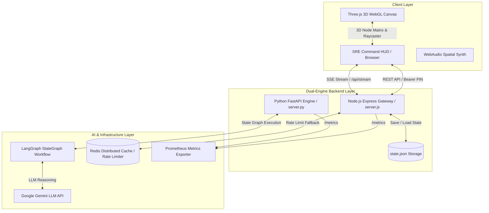
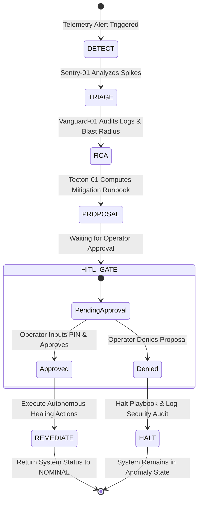

# 🏛️ Architecture Specification — Helix Quantum

Helix Quantum is architected as a **modular dual-engine monolith** designed to provide high-throughput real-time telemetry streaming and state-machine multi-agent AI reasoning.

---

## 📐 System Architecture Diagram

---

## 🤖 Multi-Agent Workflow State Machine

The SRE incident remediation graph executes through 6 sequential lifecycle phases:

---

## 🔒 Security Architecture: Human-In-The-Loop (HITL) PIN Gate

To protect production infrastructure from unauthorized or incorrect AI actions, Helix Quantum implements a strict zero-trust gate pattern:

1. **Server-Side PIN Validation:** Handled by middleware (`authGate`) via HTTP `Authorization: Bearer <ADMIN_PIN>` headers.
2. **Client-Side PIN Modal Interceptor:** If an unauthenticated request receives `401 Unauthorized`, `app.js` renders `#pin-gate-overlay` to securely solicit the PIN from the SRE operator.
3. **Optimistic Locking:** Transient SRE approval locks (`waitingApproval`) are maintained in `systemState` and persisted to `state.json`.

---

## 📊 Observability & Metrics Specification

Prometheus metrics exposed at `/metrics`:

- `helix_system_status`: Gauge indicating system state (`0 = nominal`, `1 = anomaly`, `2 = resolving`).
- `helix_active_nodes`: Operational virtual host count (`1..64`).
- `helix_latency_ms`: Real-time traffic latency in milliseconds.
- `helix_throughput_req_sec`: System throughput in requests per second.
- `helix_monthly_cost_usd`: Infrastructure monthly cost tracking.
- `helix_sse_connected_clients`: Active Server-Sent Events client connection count.
